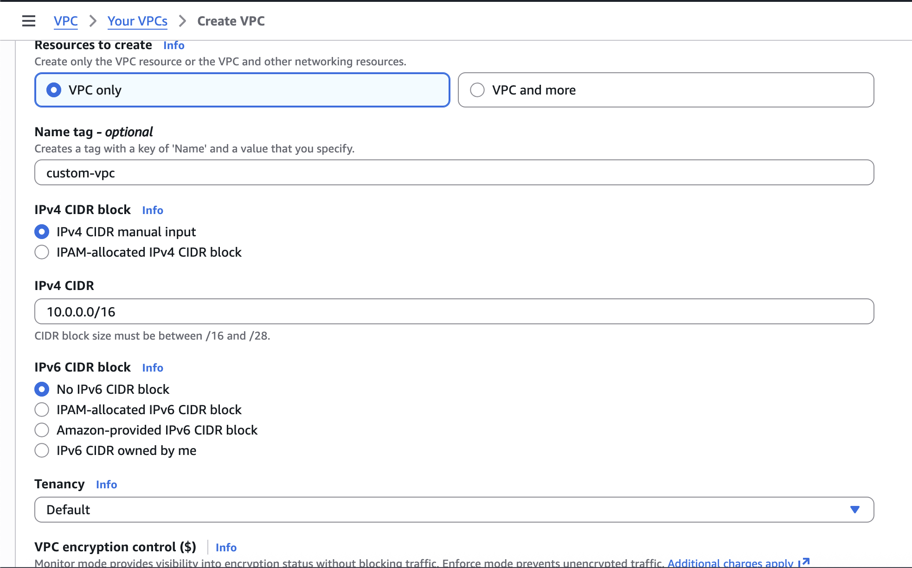
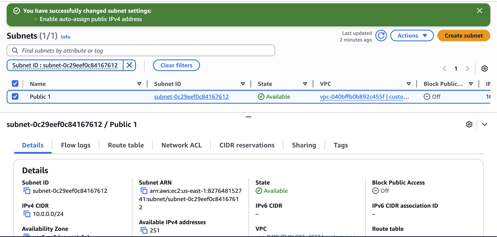
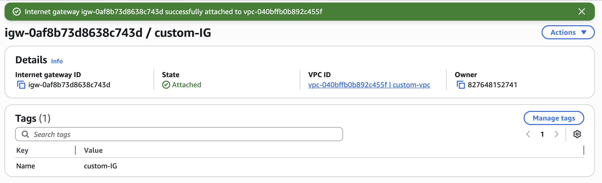
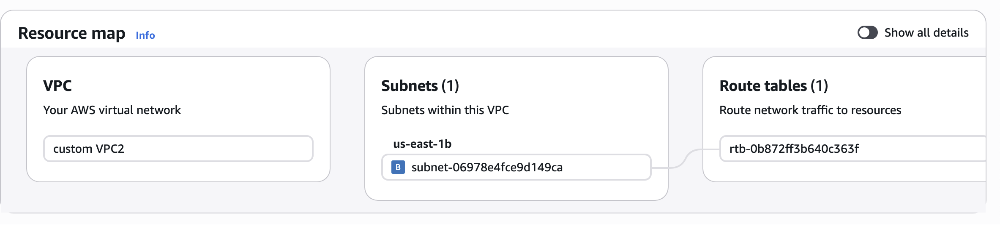
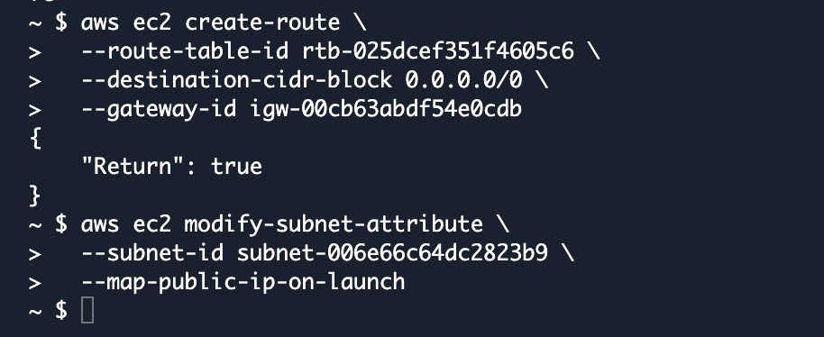

# Build a Virtual Private Cloud (VPC)

## Overview

In this project, I built a custom Virtual Private Cloud (VPC) from scratch in AWS to understand how cloud networks are designed, secured, and connected. I created a VPC, configured subnets, attached an Internet Gateway, and explored how routing and internet connectivity work within AWS. This project focused on foundational networking concepts that support secure cloud environments.

---

## Scenario

As a cloud engineer, I was tasked with building a secure network environment for future AWS resources. Before launching applications or servers, I needed to create the underlying network infrastructure that would control communication, security, and internet access.

My responsibilities in this project were to:

- Create a custom VPC
- Configure a subnet within the VPC
- Enable internet connectivity
- Understand public and private networking concepts
- Explore AWS networking through both the Console and CLI
- Troubleshoot networking and resource dependency issues

---

## What I Built

### 1. Created a Custom VPC

- Created a new Virtual Private Cloud (VPC)
- Defined a custom IPv4 CIDR block
- Established an isolated network environment for AWS resources

### 2. Configured a Subnet

- Created a subnet within the VPC
- Allocated IP addresses from the VPC CIDR range
- Enabled auto-assignment of public IPv4 addresses

### 3. Attached an Internet Gateway

- Created an Internet Gateway (IGW)
- Attached the IGW to the VPC
- Enabled communication between resources in the VPC and the public internet

### 4. Explored Public vs Private Networking

- Learned how public subnets gain internet access
- Understood the relationship between subnets, route tables, and Internet Gateways
- Explored how AWS controls network traffic flow

### 5. Used AWS CLI and CloudShell

- Created networking resources using AWS CLI commands
- Used AWS CloudShell to interact with AWS services
- Compared command-line management with the AWS Management Console

### 6. Troubleshot Networking Issues

- Resolved a subnet creation error caused by a missing CIDR block parameter
- Investigated and resolved a DependencyViolation error when deleting VPC resources
- Learned how AWS resource dependencies affect infrastructure cleanup

---

## Key Concepts Learned

- Virtual Private Clouds (VPCs)
- IPv4 CIDR Blocks
- Subnets
- Public vs Private Networking
- Internet Gateways (IGW)
- Route Tables
- AWS CloudShell
- AWS CLI
- Resource Dependencies
- Cloud Networking Fundamentals

---

## Challenges

The most challenging part was understanding AWS resource dependencies during cleanup.

When attempting to delete my VPC, AWS returned a DependencyViolation error because resources such as subnets and Internet Gateways were still attached. I learned that AWS requires resources to be deleted in a specific order before a VPC can be removed.

I also encountered an AWS CLI error when creating a subnet because I forgot to specify the required CIDR block parameter. Troubleshooting the error helped me better understand how AWS validates networking configurations.

---

## Looking Ahead

Next, I plan to continue learning:

- Route Tables
- NAT Gateways
- Security Groups
- Network ACLs
- VPC Peering
- Load Balancers
- Route 53
- Hybrid Cloud Networking
- AWS Network Security Best Practices

---

## 📸 Screenshots

Below are the screenshots documenting each step of the AWS VPC networking project.

---

### **1. Custom VPC Creation**

---

### **2. Subnet Configuration**

---

### **3. Internet Gateway Creation and Attachment**

---

### **4. VPC Resource Map**

---

### **5. AWS CloudShell CLI Commands**

